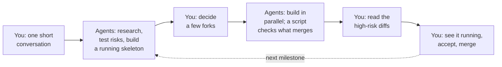

# one-punch

**A way to build software with AI agents where you make the few decisions that
matter, and the agents do everything else: in parallel, and checked.**

Most agent workflows fail in one of two ways. Either the agent asks you about
everything, and you become a full-time reviewer of questions you didn't need
to see. Or it asks you about nothing, runs overnight, and hands back
confident work built on a wrong guess.

one-punch is a set of skills for coding agents (Claude Code today) that aims
for the narrow path between those. It has been rebuilt four times, each time
because a real project showed where the previous version wasted effort or
attention. The rule it has converged on is simple:

> **Only stop for the human when, looking back, they'd be glad they were asked.**

Everything else gets decided by the agent, written down, and left easy to
reopen.

## What a project looks like

An illustration: you want an online store for a small coffee roaster. Product
pages, a cart, checkout, order emails. (This walkthrough is illustrative. The
measured results from real runs are in [How it got here](#how-it-got-here).)



### 1. You describe it, and answer a short round of questions

```
/one-punch:steer an online store for a small coffee roaster
```

The agent reads whatever is already in the repo, then asks a handful of
questions, one at a time, starting with the ones whose answers change the
most downstream:

> **Agent:** What does "done" look like? Describe the demo you'd show someone.
>
> **You:** A customer finds a coffee, adds two bags, pays, and gets an order
> email. I can see the order.
>
> **Agent:** What would be catastrophic if we got it wrong?
>
> **You:** Charging someone the wrong amount. Leaking customer addresses.
> Losing an order after taking payment.
>
> **Agent:** Here are the assumptions I think are riskiest. Rank them: (1) the
> payment provider's hosted checkout can handle subscriptions later; (2) order
> emails can be sent reliably from the host you want; (3) product data can
> live in files to begin with, with no admin screen needed yet.

This is aimed at about fifteen minutes. It produces a one-page statement of
intent, including what would be catastrophic and which assumptions could sink
the project.

### 2. You walk away. Agents run ahead of you.

Up to four agents work at once, each on a different job:

- **Test the risky assumptions by running code**, not by reasoning about them.
  One agent runs a real test-mode checkout against the payment provider and
  records exactly what happened.
- **Build a walking skeleton**: a bare store you can click through, running
  locally.
- **Find prior art**: existing store starters and the payment provider's own
  sample code, each with a note on its license, whether it's proven, and
  whether to use it as a dependency, copy from it, or only borrow its shape.
- **Gather evidence** on the open questions, such as what small stores
  typically do about guest checkout.

In an existing codebase this step looks different. The agents survey the code
you're about to change and write tests that pin down its current behavior
before anyone touches it.

### 3. You come back to a short list of real decisions

You see the skeleton running. Then the agent brings only the decisions that
pass the test above:

| You are asked | Why it's yours |
|---|---|
| Take payment on the site in version one, or only collect orders? | It changes what the product *is* |
| Hosted checkout page, or card fields embedded in your site? | Hard to reverse, and it decides how much card-handling risk you own |
| Start from the open-source store starter, or build fresh? | Adopting a dependency is a one-way door |
| Is this the right list of high-risk areas? (payments, customer data, order records) | It decides which code you will personally review |

| You are not asked | What happens instead |
|---|---|
| CSS framework, folder layout, test runner, naming | Decided, recorded with a one-line reason |
| How many products per page, image sizes, date formats | Decided, recorded |
| Which linter rules, how config is loaded | Installed from tested defaults |

Each recorded decision gets an ID. If you disagree with one later, you name
it and it's reopened. Each question you do get comes with a recommendation,
the evidence behind it, and what it would rule out.

### 4. The build runs without you

The agent cuts the work into small tickets. Each ticket declares which files
it will touch and how risky it is. Then:

- Up to four workers build at once, each in its own copy of the repo, on
  tickets that don't touch the same files.
- **A script, not an agent's say-so, decides what merges.** It re-runs your
  tests and a set of checks on the exact code about to land. "I'm done and it
  works" from an agent counts for nothing.
- Cheaper models take the routine tickets. Stronger ones take the hard and
  risky ones.
- If a worker hits a question it shouldn't answer alone, it takes the safe,
  reversible option and flags it. If the option isn't reversible, that ticket
  waits for you and the rest carry on.

### 5. You read only the diffs that could really hurt

Most tickets merge on their own: the product grid, the cart, the styling.

The checkout, the payment webhook and anything touching customer records are
treated differently. For those, a separate agent writes the acceptance tests
*before* the code exists. A reviewer from a different model family checks the
result against a list of the ways that kind of code fails quietly. Then it
waits for you to read the diff.

This is the one place the workflow deliberately spends your attention, and
it's why the question "what would be catastrophic?" was asked on day one.

### 6. You see it running, and say what's off

At the end of a milestone you get the store running. Every link you're handed
has been checked to do what its label says. For anything with a screen, the
agent has walked every page at desktop and phone width and looked at
screenshots before showing you.

You'll still spot things. Each thing you report becomes a failing test first,
then a fix, then a re-check of the neighbouring pages so the fix doesn't
break something beside it.

Then the next milestone starts, and you're only asked about decisions that
have newly come into view.

## When it stops for you, and when it doesn't

| It stops for | It does not stop for |
|---|---|
| Your intent, once, at the start | Craft decisions an experienced engineer would just make |
| One-way doors: things expensive to reverse | Anything the evidence already answered |
| Product boundaries: what the thing is and isn't | Questions it could settle by running code |
| Conflicts between what you said and what it found | Permission to proceed, when you've already seen the plan |
| High-risk diffs, before they merge | Routine diffs |
| A decision a worker couldn't safely make alone | Progress updates |
| The running result, at each milestone | |

Two details make this hold up in practice. Small, low-risk questions are
batched into a single turn, so you don't get them one at a time. And the "go
ahead and build" step is a window in which you can object, not a gate you
have to open.

## How it got here

Each version below was retired by something measured on a real project. The
records are in [docs/evidence/](docs/evidence/) and the repo history.

| Version | The idea | What a real project showed | What changed |
|---|---|---|---|
| **v1** | Write a complete spec, then let a fleet of cheap agents build it unattended | One plan took four rounds of adversarial review and 79 confirmed defects. Every fix introduced new ones at more than half the rate it removed them. The spec was making claims about how outside systems behave, in English, with nothing to run them | Stopped establishing facts in prose. A claim about how something behaves now needs code that ran |
| **v2** | Keep a human in the loop. Settle behavior by running throwaway code. Small tickets, test first | The same project then built cleanly: 9 tickets, 104 tests, no review rounds. Two facts surfaced that no amount of reading would have found | Kept as the back half of everything since |
| **v3** | Add intent-gathering, a graded evidence pass, model routing, and a retro loop | The front half stalled a real effort: 8 days, 16 decision tickets, each resolved one per session with the human, and **no code written**. Too many touchpoints, setup before value, and questions about things the agent should have decided | Replaced the front half entirely |
| **v4** | Agents run ahead in parallel. One decision sitting. Scrutiny by risk. A script decides merges | First trial, on an existing web codebase: a running skeleton in **44 minutes**, three sittings before the build, and 5 tickets built in two parallel streams in 14 minutes with no merge conflicts and no operator input. But 4 visible defects reached the operator even though every automated check was green | See below |

That last result drove the most recent round of changes. All four defects
were things you could see in a single screenshot, and the checks had only
confirmed that elements existed on the page.

- **Checks for anything visual now walk the real pages** at two widths and
  assert what each page is *for*, and the agent looks at screenshots before
  showing you.
- **Every link handed to you is verified first.** Two of the defects were
  links labelled with something the page didn't do.
- **A named "polish" stage** now covers the fixes you report after the demo.
  In the trial this was the busiest stretch for the operator, and it had no
  rules. One fix broke the case next to it.
- **Two stops were removed.** "Ratify the defaults" and "go ahead" were
  back-to-back turns with nothing new between them. They're now one. Small
  low-risk decisions are batched.
- **A lighter mode is now official** for small or time-boxed work, with one
  condition: every change still lands through the checking script.

Some things were tried and deliberately dropped. An earlier version put
headless workers behind sandbox walls and probed for escapes. It took nine
live test runs to establish and wasn't worth the cost, so workers now run
freely inside their own copy of the repo and the merge script guards what
lands. Having a second agent review every ticket was considered and left
out, after another project's measurements showed that kind of review doubled
the time without improving the result. Extra review goes only where the risk
is.

## What keeps the output honest

- **Risk decides scrutiny.** Every change gets a level, from contained
  (docs, tests) to severe (auth, money, destructive data operations, and the
  files that define the checks themselves). The level sets which model
  builds it, who writes the tests, who reviews, and whether you read the
  diff. A check on the actual diff catches a ticket that was labelled lower
  than what it touched. This is called blast radius in the docs.
- **Facts come from running code.** Anything the plan depends on about an
  outside system is settled by a short experiment with a saved transcript.
- **Code standards in three layers.** A short list of rules the agents read,
  lint checks the merge script enforces, and a review checklist for what
  tools can't judge. An exception to a rule has to be a recorded decision,
  so an agent can't grant itself one.
- **Decisions have one owner.** The planning agent makes design decisions and
  records them. Workers build. Two workers never decide the same question two
  different ways.
- **The process measures itself.** Each milestone ends with a retro that
  counts, among other things, how many tickets merged unattended for each
  time you had to step in unplanned.

## Where it stands

- **Works today in Claude Code.** OpenAI's Codex is used as the
  second-opinion reviewer for high-risk changes. Support for another agent
  tool is claimed only when its row in the
  [smoke checklist](docs/vendor-smoke.md) passes.
- **The front half is trial-tested** on a real codebase, with the results
  above.
- **The unattended parallel build loop is tested but young.** It passes its
  own suite (126 tests, strict type checks) and live runs with four
  concurrent workers. The first real trial used the lighter mode, so the
  full loop has not yet carried a whole real project end to end. That is the
  next trial.
- **It is opinionated and built for one operator's way of working.** Take
  what's useful.

## Install

Claude Code:

```bash
claude plugin marketplace add dwijenpatel/one-punch
claude plugin install one-punch@one-punch
```

Update, then start a new session:

```bash
claude plugin marketplace update one-punch
claude plugin update one-punch@one-punch
```

one-punch builds on two other projects: the
[mattpocock-skills](https://github.com/mattpocock/skills) plugin and the
[evidence-kit](https://github.com/dwijenpatel/evidence-kit) research method.
You don't need to install them first. The first step of every run checks for
each one and prints the exact command for anything missing or out of date.

Other agent tools: the skills follow the
[Agent Skills open standard](https://agentskills.io) and install with
`npx skills@latest add dwijenpatel/one-punch`.

## First run

In your project directory, new or existing:

```
/one-punch:steer <your idea, in a sentence or a paragraph>
```

Coming back later, in any session or on any clone:

```
/one-punch:steer resume
```

## What's inside

Skills, in [plugin/skills/](plugin/skills/):

| Skill | What it does |
|---|---|
| **steer** | The front door. Runs the whole flow above and can report where an effort stands |
| **intent** | The opening conversation |
| **decision-memo** | Sorts decisions into "ask" and "record", and runs the decision sitting |
| **blast-radius** | Risk levels, the per-repo risk map, and checklists of how risky code fails quietly |
| **code-style** | The three-layer code standards |
| **field-guide** | A short file of surprises and traps the agents keep for each other |
| **worker-harness** | The parallel build loop and the script that decides what merges |
| **spike** | Settles a factual question by running code |
| **retro** | Turns a milestone's records into measured findings and proposed changes |
| **contract-review** | One adversarial pass over a written spec, on request |
| **learning-gates** | Optional: gates progress on what *you* have learned, if that's a goal |

The full process, with the stage names the skills use (H1, A1, H2, A2, Build,
H3, Polish), is in [docs/design/pipeline.md](docs/design/pipeline.md).

## Developing one-punch

Working rules: [AGENTS.md](AGENTS.md). To try a local clone, pass its path to
`claude plugin marketplace add` in place of `dwijenpatel/one-punch`.

One command runs every test suite and the strict type checks
(needs [uv](https://docs.astral.sh/uv/)):

```bash
bash plugin/skills/worker-harness/references/harness/verify.sh
```

Running one-punch on its own repo needs one decision first. The default risk
map classes the build loop's source as severe, because that code names the
payment, auth and data-deletion patterns the map looks for. Either accept
that, and review every change to it, or record a deliberate lower level for
that path.

MIT licensed.
